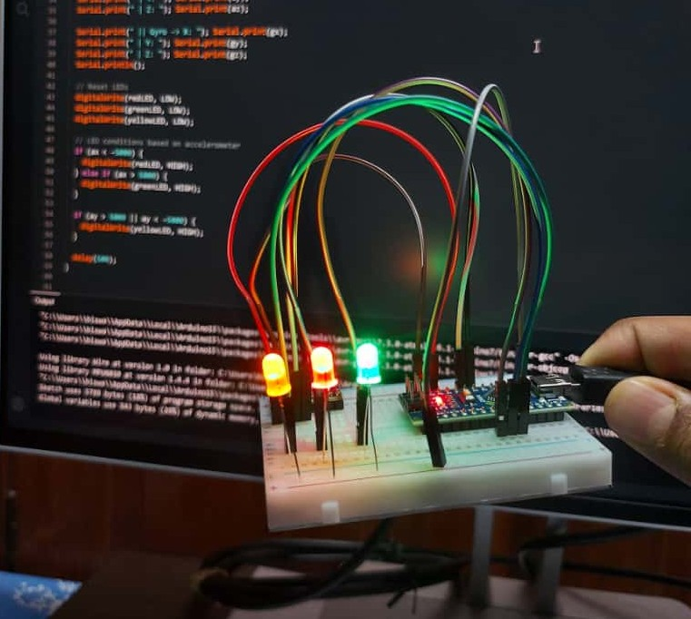
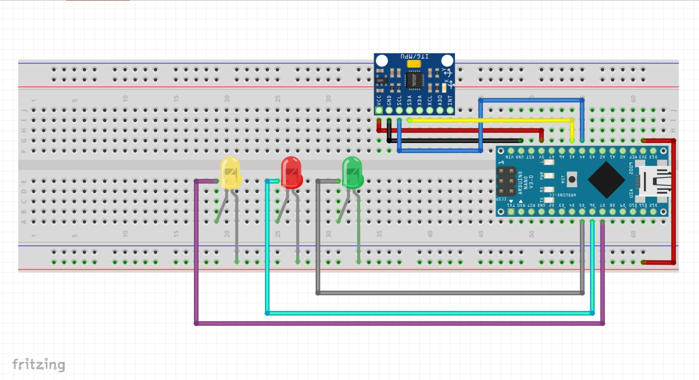

# ✨ Motion-Sensing LEDs with Arduino Nano + MPU6050

This project demonstrates how an **MPU6050 accelerometer + gyroscope** sensor can be used with an **Arduino Nano** to control LEDs based on motion and tilt. It’s a beginner-friendly experiment that introduces **I2C communication, sensor data handling, and real-time hardware interaction**.

---

## 📌 Features

* Reads **accelerometer & gyroscope data** from the MPU6050 sensor.
* Lights up LEDs depending on **tilt direction**:

  * 🔴 **Red** → Left tilt (X-axis negative)
  * 🟢 **Green** → Right tilt (X-axis positive)
  * 🟡 **Yellow** → Forward/Backward tilt (Y-axis)
* Real-time **serial monitor output** for debugging.


---

## 🛠️ Components Used

* Arduino Nano
* MPU6050 (Accelerometer + Gyroscope)
* 3 × LEDs (Red, Green, Yellow)
* 3 × 220Ω resistors
* Breadboard + jumper wires

---

## ⚡ Circuit Diagram

📷 *Simple schematic for quick reference:*



* **MPU6050 → Arduino Nano**

  * VCC → 5V
  * GND → GND
  * SDA → A4
  * SCL → A5
* LEDs connected to pins **D5, D6, D7** with resistors.

---

## 💻 Code

The main logic:

```cpp
if (ax < -5000) {
  digitalWrite(redLED, HIGH);
} else if (ax > 5000) {
  digitalWrite(greenLED, HIGH);
}

if (ay > 5000 || ay < -5000) {
  digitalWrite(yellowLED, HIGH);
}
```

---

## 📸 Demo

[Linked In](https://www.linkedin.com/posts/agnickghosh_arduino-mpu6050-iot-activity-7363185609491828737-e5yU?utm_source=share&utm_medium=member_desktop&rcm=ACoAAFjMA8MBY00uITVavSa9bj04Bi51aavZIos)

---

## 🎯 Applications

* Motion-controlled games 🎮
* Gesture-based UI controls ✋
* Robotics & self-balancing bots 🤖
* Wearable devices & IoT projects 🌐

---

## 🚀 Key Learnings

* Using **I2C protocol** on Arduino Nano (SDA=A4, SCL=A5).
* Reading & interpreting **raw accelerometer/gyroscope data**.
* Mapping motion to **physical outputs (LEDs)**.
* Debugging with the **Serial Monitor**.

---

## 📌 Tags

`Arduino` `MPU6050` `I2C` `MotionSensor` `EmbeddedSystems` `IoT` `HardwareProjects`

---

